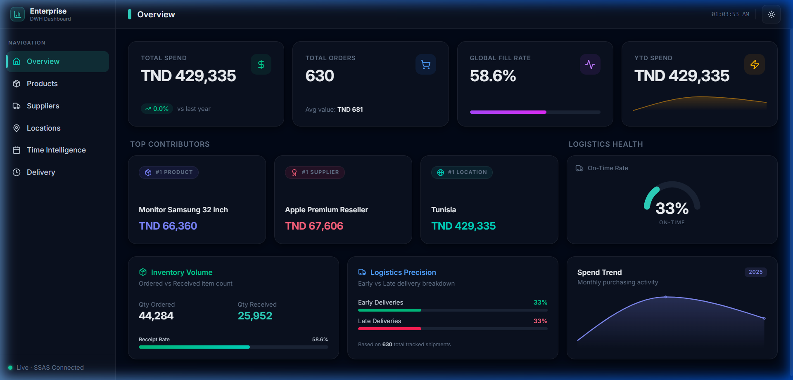
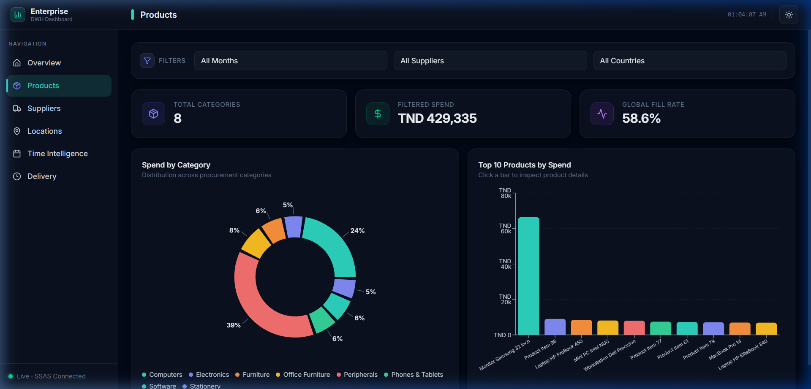
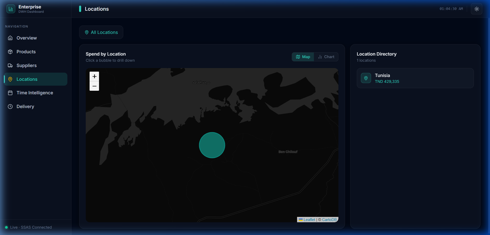
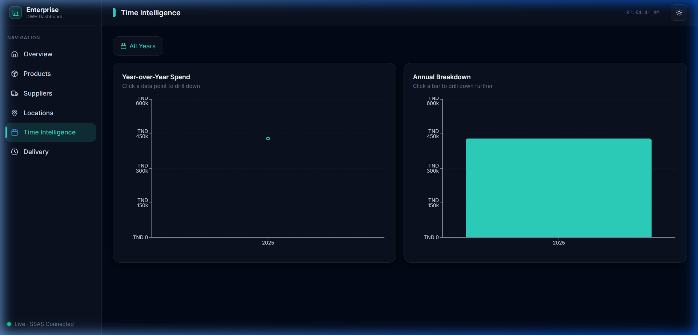
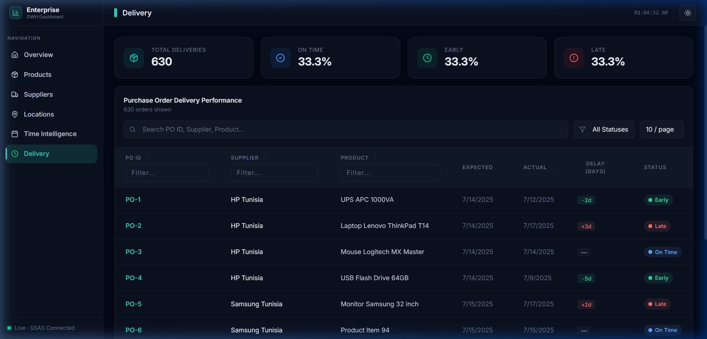
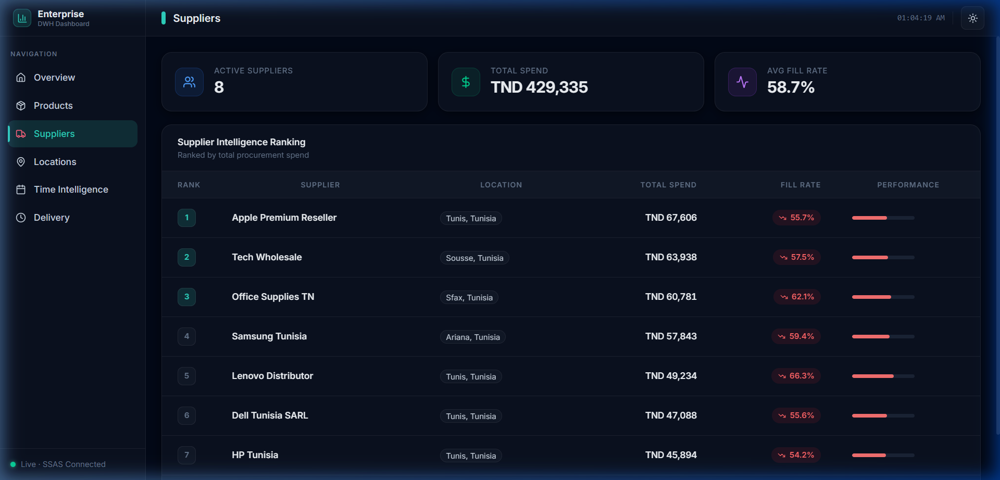

# Enterprise Procurement Analytics Dashboard

A modern, full-stack enterprise data warehouse and business intelligence dashboard for procurement and logistics tracking. 

## System Architecture & Project Structure

The project consists of four main components, each documented in its own guide within its directory:

1. **OLAP Multi-dimensional Cube (SSAS) ([EnterpriseCube/README.md](EnterpriseCube/README.md))**:
   - Multi-dimensional Cube definition for dimensional modeling (Geography, Suppliers, Products, Date, and Time).
   
2. **Data Warehouse & ETL Pipeline (SSIS) ([EnterpriseDWH/README.md](EnterpriseDWH/README.md))**:
   - SSIS Packages (`Dimensions.dtsx`, `Fact.dtsx`) to extract, transform, and load source data into the Enterprise Data Warehouse.

3. **Web API Service ([EnterpriseDashboard.API/README.md](EnterpriseDashboard.API/README.md))**:
   - ASP.NET Core API at `/EnterpriseDashboard.API` that queries the SSAS Cube using MDX.

4. **Frontend Dashboard ([EnterpriseDashboard.UI/README.md](EnterpriseDashboard.UI/README.md))**:
   - React + TypeScript dashboard at `/EnterpriseDashboard.UI` featuring interactive data visualizations.

## Dashboard Showcase

Here is a visual overview of the different interactive views available in the Enterprise Dashboard:

### 1. Overview Dashboard
Displays high-level KPIs (Spend, Volume, Fill Rate), logistics health, inventory volumes, and spend trends.


### 2. Product Analysis
Shows spend distribution by categories and the top products.


### 3. Location Drilldowns
Provides geographic spend analysis with interactive drilldown maps and tables.


### 4. Time Intelligence
Aggregates and filters spend trends across years, quarters, and days.


### 5. Delivery Performance
Tracks purchase orders, actual/expected timelines, and delay metrics.


### 6. Supplier Performance
Ranks suppliers based on spend volume and delivery precision.


## Key Features

- **Overview Dashboard**: High-level KPIs (Total Spend, YTD Spend, Global Fill Rate, Total Orders), Top Contributors (#1 Product, #1 Supplier, #1 Location), Logistics Health (On-Time rate), and custom bottom-row widgets for Inventory Volume, Logistics Precision, and Spend Trend charts.
- **Product Analysis**: Spend by Category (donut chart with clean label connectors) and Top 10 Products by Spend (horizontal bar chart).
- **Location Drilldowns**: Interactive geographic map representation of Spend by Location with click-to-drill-down capabilities and dynamic bar/table views.
- **Time Intelligence**: Annual, quarterly, and daily breakdown trends with interactive click-to-drill-down on years and quarters.
- **Delivery Performance**: Purchase Order tracking table showing delivery status, delay days, actual/expected dates, and column filters.

## Getting Started

### Prerequisites

- .NET 8 SDK (for API service)
- Node.js (v18+ recommended for Frontend)
- SQL Server, SSIS, and SSAS (OLAP Cube) installed and running

### Running the API

1. Navigate to the API directory:
   ```bash
   cd EnterpriseDashboard.API
   ```
2. Run the development server:
   ```bash
   dotnet run
   ```
   The API will start on `http://localhost:5002` (or configured port).

### Running the Frontend

1. Navigate to the UI directory:
   ```bash
   cd EnterpriseDashboard.UI
   ```
2. Install dependencies:
   ```bash
   npm install
   ```
3. Run the development server:
   ```bash
   npm run dev
   ```
   Open `http://localhost:5173` in your browser.

